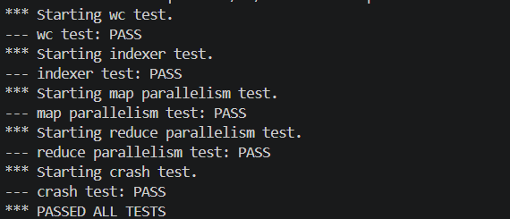

# Distributed MapReduce Framework in Go

An independent implementation of a distributed MapReduce framework,
based on MIT 6.824 Spring 2020 Lab 1.


## Test Results



Passed all five provided test categories:

- Word-count correctness
- Indexer correctness
- Map parallelism
- Reduce parallelism
- Worker crash recovery

See [lab1-test-output.txt](lab1-test-output.txt) for the complete results.

## Architecture

The system consists of:

- One coordinator that schedules Map and Reduce tasks
- Multiple workers communicating with the coordinator through RPC
- Hash-partitioned intermediate key-value files
- Task timeout and reassignment for worker failure recovery
- Atomic file publication to prevent partially written output

## Engineering Highlights

- Implemented concurrent Map and Reduce task scheduling
- Partitioned intermediate data using `hash(key) % nReduce`
- Added ten-second worker timeout detection and task reassignment
- Used JSON encoding for intermediate key-value data
- Sorted and grouped keys before invoking Reduce functions
- Used temporary files and atomic renames for crash-safe output

## Technologies

- Go
- RPC
- Concurrency
- Distributed systems
- MapReduce
- Fault-tolerant task scheduling

## Running the Tests

Requirements:

- Linux or WSL
- Go
- Bash

Run:

```sh
cd src/main
sh test-mr.sh